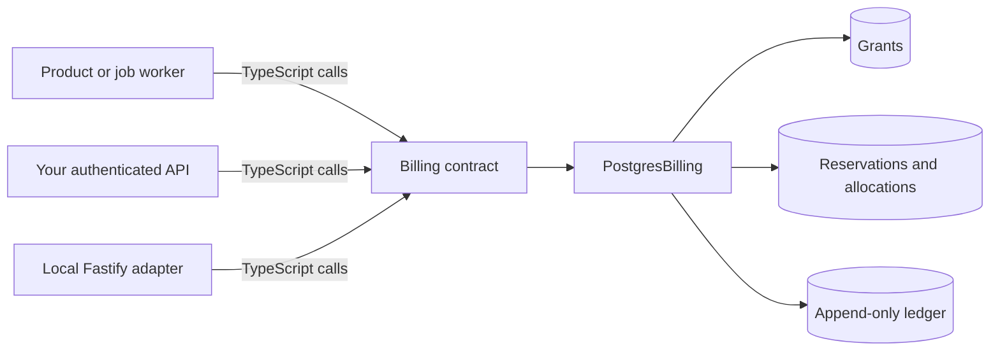

# Architecture and invariants

Velobase keeps the accounting core small and places product-specific policy outside it.

## Public boundary

`packages/billing` owns the public contract, validation, allocation rules, transactions, locks, migrations, and read models. It knows nothing about HTTP sessions, plans, prices, payment processors, invoices, or UI frameworks.

`apps/api` is deliberately thin. It parses JSON, maps stable domain errors to HTTP status codes, and fixes tenant and project scope from trusted server configuration. It is useful for local evaluation and as a reference adapter, but it is not a production gateway.

## Accounting invariants

Every write is executed in a PostgreSQL transaction and preserves these rules:

1. Grant totals, used amounts, and reserved amounts are non-negative safe integers.
2. A grant never has more used plus reserved credits than its total.
3. A reservation never settles or releases more than it reserved.
4. A reservation has one terminal outcome: `SETTLED` or `RELEASED`.
5. An idempotency identity cannot be reused with different semantic input.
6. Every balance mutation has a corresponding append-only ledger entry.
7. Tenant and project scope are included in identities, locks, and reads.

The database repeats critical bounds as `CHECK` constraints. Application validation provides clearer errors; database constraints provide a final line of defense.

## Concurrency model

Grant creation and reservation creation take transaction-scoped PostgreSQL advisory locks using their external identity. Requests competing for the same customer wallet also take a wallet lock before selecting eligible grants with row locks.

This order makes retries serialize before reading mutable balances and prevents two workers from spending the same credit. No in-memory lock or single-process assumption is required.

## Allocation model

Eligible grants are ordered first-expiring-first-out (FEFO). Grants without an expiry are last, and ties are resolved by creation order and identifier. The selected allocation order is persisted so retries and later terminal operations see the same deterministic breakdown.

## Ledger model

The ledger is append-only: corrections are represented as new operations rather than updates to history. A settlement writes one `SETTLE` entry for the amount charged and a `RELEASE` entry for any unused reservation. Cursor pagination uses both timestamp and identifier so entries sharing the same timestamp are never skipped.

## Migrations

`migrate(pool)` applies ordered SQL files inside transactions. Each applied file is recorded with a SHA-256 checksum. If a historical migration changes, startup fails and asks for a new migration instead of silently accepting divergent schemas.

## Extension seams

Keep product policy outside the core and translate it into the small billing vocabulary:

- Convert prices or model usage into integer credit amounts before `reserve` and `settle`.
- Use wallets to separate independently spendable balances such as `video`, `image`, or `tokens`.
- Use sources to explain where grants came from, such as `purchase`, `subscription`, or `promotion`.
- Put your order, job, or request identifier into `transactionId`.
- Attach small JSON metadata for audit context, not large payloads or secrets.
- Run `settleDue` from your own scheduler if abandoned reservations need an automatic terminal action.
